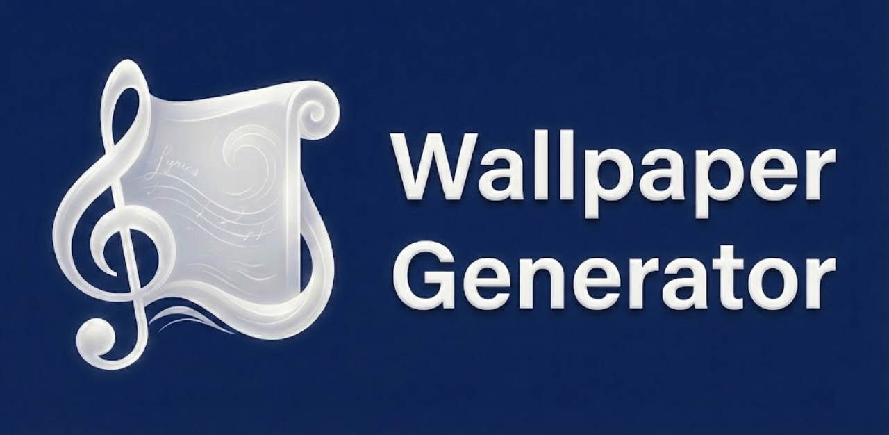

 

  

<h3 align="center">Wallpaper Generator by Lxrin</h3>

  

    Generate custom wallpapers from your favorite song lyrics.
     
    <a href="https://wallpapergenerator.lxrin.ch"><strong>Explore the Website »</strong></a>
     
     
    <a href="https://github.com/noebachofner/WallpaperGenerator/issues">Report Bug</a>
    ·
    <a href="https://github.com/noebachofner/WallpaperGenerator/issues">Request Feature</a>
  

## About The Project

**Wallpaper Generator** is a web-based tool designed to turn music into visual art. It allows users to search for song lyrics and instantly create aesthetic wallpapers for mobile or desktop devices.

### Impressions

**Coming Soon!**

  

### Features

Here are some of the project's best features:

* **Full Customization:** Pick your own fonts, colors, and layouts. You have total control over the aesthetic.
* **Quality Downloads:** Get high-quality wallpapers optimized for any screen size (Mobile/Desktop).
* **Fast & Easy:** Just search for your song using the integrated API and create your design in seconds.

### Built With

Thanks for these great open source Repositories:

* [Vanta.js](https://github.com/tengbao/vanta) - For the animated web backgrounds.
* [LRCLIB](https://github.com/tranxuanthang/lrclib) - Free Music Lyrics API.

## How to Use

1.  Go to [wallpapergenerator.lxrin.ch](https://wallpapergenerator.lxrin.ch).
2.  Use the search bar to find a song by title or artist.
3.  Select the lyrics you want to feature on your wallpaper.
4.  Customize the background, font style, and colors using the editor tools.
5.  Click **Download** to save your creation.

## Roadmap

See the [open issues](https://github.com/noebachofner/WallpaperGenerator/issues) for a full list of proposed features (and known issues).

## License

Distributed under the GPLv3 License. See `LICENSE` for more information.

## Contact

Lxrin - [contact@lxrin.ch]

Project Link: [https://github.com/noebachofner/WallpaperGenerator](https://github.com/noebachofner/WallpaperGenerator)